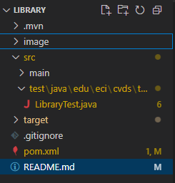
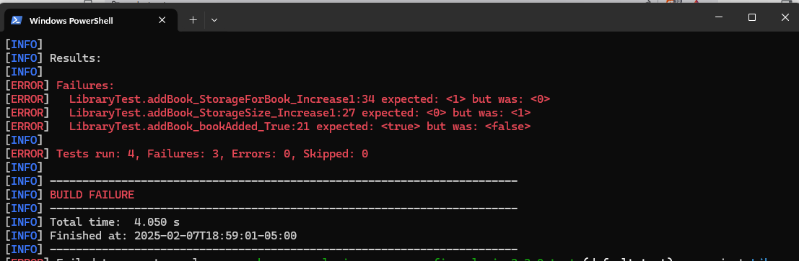
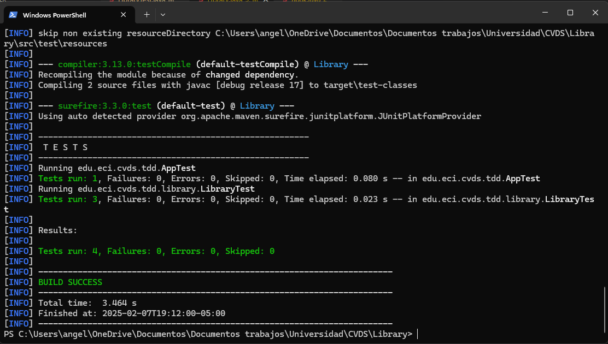
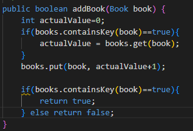
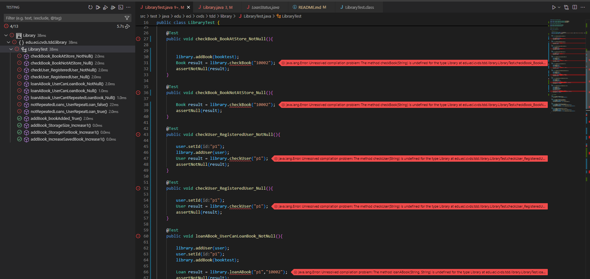
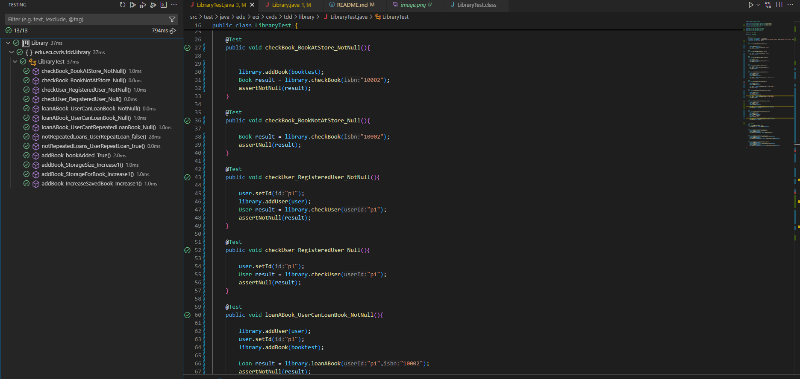
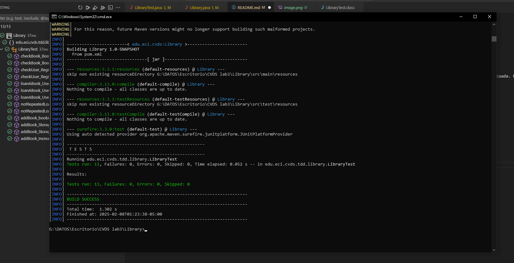
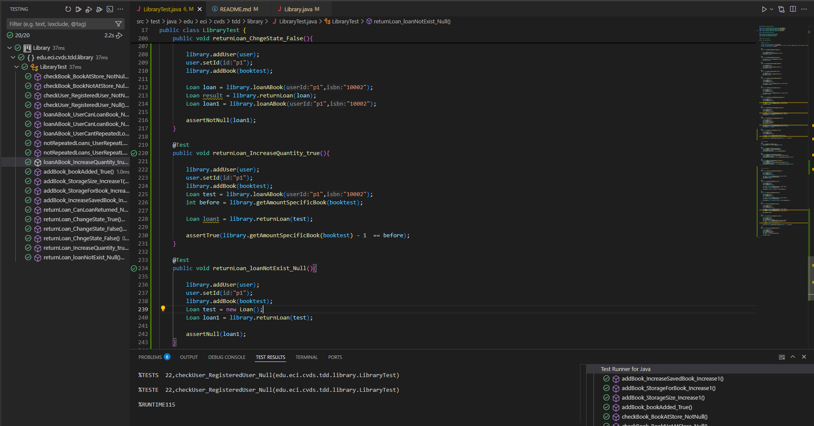
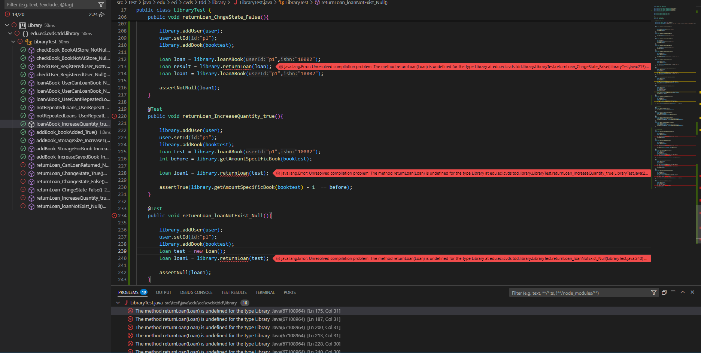
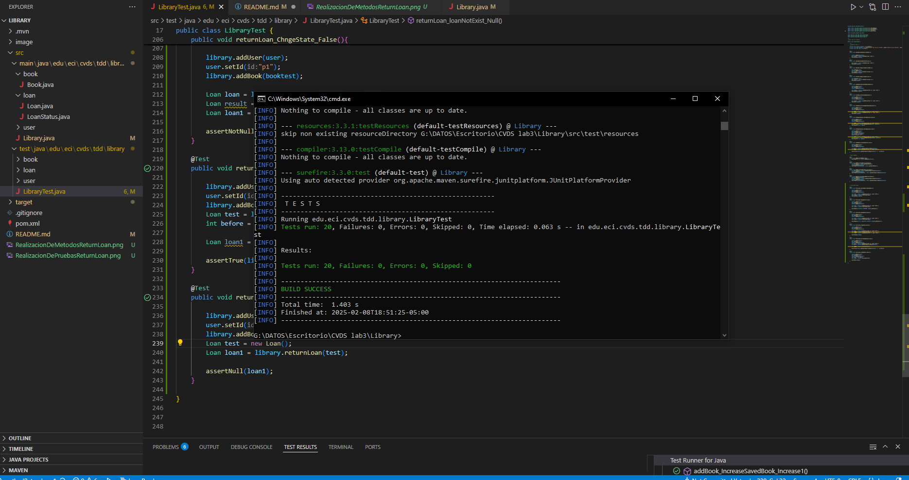

# Lab03CVDS
## Integrantes
Yojhan Toro - Ivan Cubillos
## Desarrollo

En primer lugar se crean las clases espejo para poder operar los metodos de prueba de una buena manera.

Posteriormente se agrega Jacoco al archivo pom.xml para que nos arroje la cobertura de pruebas.
### Metodo loanAbook
Como paso siguiente se programan las pruebas con los resultados esperados y se ejecuta el pom para rectificar que las este probando de manera adecuada. Nos arroja el siguiente resultado:

Posterior a eso se codifica el metodo, para que pasen las pruebas. Se ejecuta nuevamente el pom y obtenemos el siguiente resultado:

Para que pasará el metodo se uso el siguiente metodo:

### Metodo loanAbook

Primero hacemos las pruebas de unidad y las corremos para que nos generen error

Posteriormente codificamos el los metodos necesarios para que las pruebas pases correctamente 

Ahora verificamos con Jacoco que no halla ningun error 

### Metodo returnLoan

Primero hacemos las pruebas de unidad y las corremos para que nos generen error

Posteriormente codificamos el los metodos necesarios para que las pruebas pases correctamente 

Ahora verificamos con Jacoco que no halla ningun error

